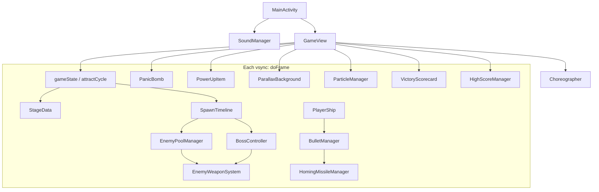

# WW2 Blitz

Portrait Android shoot-’em-up. You fly a fighter up a scrolling WWII theater, punch through scripted waves, strip a multi-part boss, and carry score across four stages.

The codebase is a **Choreographer-driven `SurfaceView` loop** in Kotlin (`com.cc.ww2blitz`). The hot path is built to allocate **nothing per frame**: fixed object pools, primitive timers, `while` loops, and a recycled `StringBuilder` for HUD text.

---

## What you play

You are a single plane at the bottom of a portrait screen. Enemies come from the top in formations. You shoot automatically while you hold the screen, dodge green bullets, grab power-ups, and bomb when a wave is about to eat you.

There are **four stages**. Each one is a timed script that ends in a boss. Beat the boss, take the stage-clear bonus, and the next map loads. Beat stage 4 and the campaign is over—it does not wrap back to stage 1.

### Controls

| Input | Effect |
| --- | --- |
| Drag | The ship follows your finger (relative drag, not absolute snap). Banking sprites change with horizontal speed. |
| Hold | Auto-fire. Weapon shape depends on power level (vulcan stream, then extra shots, then homing missiles). |
| Double-tap | Panic bomb if you have one. Screen-filling blast, extra shake, heavy damage to waves and exposed boss parts. |
| Tap on title | Starts a real campaign from stage 1. |
| Tap **[ AUDIO SETTINGS ]** | BGM / SFX sliders. |

You begin with **3 lives**, **3 hits per life**, and **3 bombs**. Hits are shown as a small bar. Invulnerability after a hit/respawn is a timer, not a special object.

### Power-ups and score

Waves drop:

- **P** — weapon power (caps internally; extra drops become medals).
- **B** — extra bomb (capped at 3; extras become medals).
- **Medals** — face-up 2000, edge-on 200. They are score, not lives.

Destroying enemies and collecting medals add to `campaignScore` (clamped at 99,999,999). Stage clear adds **10,000 per remaining life** and **5,000 per remaining bomb**, ticker-animated like a 90s arcade cabinet.

### Bosses

Each boss is one sprite sheet cut into **parts** (wings, guns, core). You must destroy the outer modules first. The **core is immune** until every other part is gone (`isCoreVulnerable()`). Dead modules leave wreck overlays. When the core dies, an explode sequence runs, then stage clear.

| Stage | Feel | Scroll | Boss gate |
| --- | --- | --- | --- |
| 1 | Canyon airfield | 180 px/s | ~38 s |
| 2 | Super-tank ground | 260 px/s | ~30 s |
| 3 | Ocean / carrier | 200 px/s | ~25 s |
| 4 | Jungle air fortress | 310 px/s | ~45 s |

Enemy archetypes: **drone**, **kamikaze**, **interceptor**, **heavy**. Patterns include V-hold, weave, walls, diamonds, and pincers—authored as elapsed-time cues, not entity graphs.

### Attract mode (idle cabinet)

If you leave the title alone:

1. **Title** (~4 s) — logo, blinking **1P START**.
2. **CPU demo** (~30 s) — AI flies a **random stage 1–4**, never the same stage twice in a row. Score from demo is **not** saved.
3. **Top 10** (~4 s) — ranks, 8-digit scores, 3-letter names, max stage.

Touch during demo or ranking snaps back to the title.

### Game over and names

On a real death you get a **GAME OVER** hold (~9 s, or tap to skip). If the score beats 10th place, **REGISTRATION**: tap left/right of the active letter to cycle A–Z, lock with the bottom prompt, three initials. Then the ranking page. If you do not qualify, you go straight to ranking.

Campaign complete (stage 4 clear) is its own screen: congratulations, final score, then the same qualify → register or ranking path.

High scores persist in `SharedPreferences` (`arcade_leaderboard`): 10 slots of score, packed 3-char names, max stage cleared.

---

## Design choices

These are the product rules that drove the architecture. They are not incidental style.

### 1. Arcade cabinet, not a mobile “session”

Title → demo → ranking is the same loop as a 1990s PCB left on in a dark arcade. Demo length is long enough to show formations and a boss cue (~30 s). Attract never writes the leaderboard.

### 2. Zero allocation on the frame

Android GC hitching is death for a shmup. The contract is: **`doFrame` must not allocate**. That forbids `ArrayList`, iterators, string concat, boxing, and per-shot `new`. Pools, `IntArray`/`CharArray`, `while (i < n)`, and one `StringBuilder` for all HUD.

### 3. Time-scripted stages, not a level editor graph

Waves are functions of `elapsedTime` plus a handful of boolean “already spawned” flags. That matches Psikyo-style density control and keeps spawn logic off the heap. Stages 3–4 **freeze the timeline clock** at the boss gate so leftover fodder does not keep spawning behind the fortress.

### 4. Multi-hitbox bosses, peel then core

A single AABB would feel cheap. Parts have their own HP and wreck art. Core vulnerability is a derived boolean, not a second boss type. Combat patterns are per-stage timers (chin guns, sponsons, flak, gatling, desperation rings).

### 5. Relative drag + auto-fire

Absolute “finger = ship” fights the HUD and thumbs. Relative drag plus hold-to-fire is how 1942-style phone ports stay readable. Double-tap bomb is a discrete gesture so bombs are not spent on ordinary movement.

### 6. Green chroma, not PNG alpha from the pipeline

Sprites are authored on neon green. At load, pixels matching `g > 160 && g > r + 40 && g > b + 40` go to alpha 0. Art can stay simple 32-bit sheets; the engine keys them once.

### 7. Cover-scaled parallax, not stretched 9:16

Ground/mid/high layers are 2:3-ish and **cover-scaled** (uniform scale, center crop) so phones do not squash hangars and ships. Mid/high clouds are black-keyed with `PorterDuff.Mode.SCREEN`.

### 8. Hardware canvas, vsync clock

`Choreographer.FrameCallback` is the clock (`dt` clamped to 50 ms). On API 26+ the surface is `lockHardwareCanvas()`. This is a game loop, not Compose recomposition.

### 9. Audio off the frame

SFX: `SoundPool`, preloaded IDs, no alloc in `playSFX`. BGM: dual `MediaPlayer` gapless chain, switch on the main looper, not inside `doFrame`. Volumes persist. Title sliders write scales only.

### 10. Persistence is primitives + `apply()`

Leaderboard is three parallel arrays, in-place insert, `editor.apply()`. Load once at boot (`hydrated` flag). No JSON, no Room on the attract path.

---

## From design to components

| Design rule | What it became in code |
| --- | --- |
| Cabinet attract | `GameView` states `STATE_TITLE` / `STATE_DEMO` plus `ATTRACT_*` cycle timers; `demoPilot()`; `HighScoreManager` draw page |
| No GC in combat | Every combat type is a **fixed `Array` pool** (`Enemy`, `PlayerBullet`, `EnemyBullet`, missiles, explosions, pickups) |
| Scripted waves | `SpawnTimeline` + primitive flags; `StageData` holds scroll speed and boss-at seconds |
| Peel bosses | `BossController` + `BossComponent[14]`; wreck bitmaps; `isCoreVulnerable()` |
| Relative flight | `PlayerShip.onTouch` pointer id + last XY; bank frames 1–7 |
| Auto-fire / bombs | `BulletManager` cooldown; `PanicBomb` 6-frame sheet; `GameView` double-tap window |
| Green key | `keyGreen` / loadKeyed on player, enemies, boss, particles, missiles, pickups |
| Parallax | `ParallaxBackground` three bitmaps + optional stage 2–4 ground override from `GameView` |
| Vsync + GPU blit | `GameView.doFrame` → update all systems → `lockHardwareCanvas` → draw |
| SFX/BGM | `SoundManager` singleton; `GameView.syncBgm()` picks raw by state |
| High scores | `HighScoreManager` object; `STATE_REGISTRATION`; SharedPreferences |
| Campaign end | `STATE_CAMPAIGN_COMPLETE` instead of `advanceToNextStage()` wrapping to 1 |
| Score ticker | `VictoryScorecard` visible* integers ramping; no format objects |

`GameView` is the **orchestrator**: it owns the state machine, collision, attract, UI, and the call order. Subsystems do not know about screens.

---

## Architecture (high level)



**Boot:** `MainActivity` hides system bars, inits `SoundManager`, constructs `GameView`. `GameView.init` calls `HighScoreManager.loadHighScores` once. `surfaceCreated` posts the Choreographer callback.

**Frame:** `doFrame` computes `dt`, branches on `gameState`, updates only the systems that screen needs, then draws parallax → sprites → HUD. Unlock/post, then post the next callback.

**Play interaction (simplified):**

1. `SpawnTimeline` activates `Enemy` slots and, at the gate, `BossController.beginEntranceForStage`.
2. Enemies and boss fire through `EnemyWeaponSystem.fireBullet`.
3. Player drag updates `PlayerShip`; hold feeds `BulletManager` / `HomingMissileManager`.
4. `GameView.resolveCollisions` walks pools with radius/AABB tests, awards score, triggers particles, peel-damages boss parts.
5. Boss core dead + explosion finished → `VictoryScorecard.trigger` → `STATE_CLEAR`.
6. Player lives exhausted → `STATE_GAMEOVER` → qualify → `STATE_REGISTRATION` or attract ranking.

Subsystems expose **activate / update / draw / deactivateAll**. They do not hold `Canvas` across frames; they blit with preallocated `RectF`s.

---

## Component chapters

### `MainActivity`

Thin `Activity` shell. Immersive window, keep-screen-on, music stream for volume keys. Lifecycle: init audio on create, pause/save volumes on pause, resume audio, `SoundManager.release()` on destroy. The only view is `GameView`—no XML layout, no Compose.

### `GameView`

The engine. Implements `SurfaceHolder.Callback` and `Choreographer.FrameCallback`.

**State integers** (not enums, so no extra objects on the machine):

| Constant | Role |
| --- | --- |
| `STATE_TITLE` | Attract title / ranking overlay / settings |
| `STATE_PLAYING` | Real campaign |
| `STATE_CLEAR` | Scorecard after a boss |
| `STATE_GAMEOVER` | Death hold |
| `STATE_DEMO` | CPU attract play |
| `STATE_REGISTRATION` | Three-initial entry |
| `STATE_CAMPAIGN_COMPLETE` | After stage 4 clear |

Attract overlay: `ATTRACT_TITLE` / `ATTRACT_CPU_DEMO` / `ATTRACT_HIGH_SCORE` with `attractCycleTimer`.

**Update order in play/demo:** parallax scroll → demo AI if needed → player → player bullets/missiles → pickups → floating scores → timeline → enemies → boss → enemy shots → bomb → particles → collisions → stage-clear / demo-timeout checks.

**Draw order:** parallax (stage ground bitmap override for 2–4; forced canyon on registration; stage 4 sheet on campaign complete) → shake translate → enemies, boss, player, pickups, bullets, missiles, enemy shots, particles, bomb → HUD.

**Collisions** live here on purpose: they need every pool at once. Hits use small player radius vs enemy bullets, body fractions vs rams, padded AABBs vs boss parts. Bombs accumulate DPS banks so a 0.5 s anim does not one-shot or starve the core rules.

**UI:** one `StringBuilder`, shared `Paint`s. Registration, ranking, campaign-complete, and settings are draw functions plus hit `RectF`s—not Views.

**Demo AI (`demoPilot`):** steer toward lowest on-screen threat / boss part, dodge nearby downward shots, sine wander when idle. Auto-fire on. `lastDemoStage` plus LCG rejects a repeat stage.

### `StageData`

Playlist (`STAGE_SEQUENCE` 1–4), current id, `scrollSpeedY`, `targetBossTimelineSeconds`. `currentStage` is a getter over private `stageId` so `setCurrentStage(Int)` does not clash with a Kotlin property setter on the JVM. `advanceToNextStage` wraps the playlist (campaign complete **intercepts** wrap after stage 4 in `GameView`). `applyStageMetrics()` is the only place those two floats change.

### `SpawnTimeline`

Elapsed-time director. `update(...)` increments `elapsedTime` (except 3/4 after the boss cue), runs a stage-specific `updateStageN`, then maybe `boss.beginEntranceForStage`. Flags like `vFormSpawned` ensure a wave fires once. Opening V and a power-up safeguard keep the player from sitting at power 1. `reset()` zeros every cursor. No event queue objects—`SpawnEvent` exists as a leftover data shape; the live director is this class’s timers.

### `Enemy` and `EnemyPoolManager`

`Enemy` is a **plain data slot**: position, velocity, type, pattern, HP, fire timers, formation flags. Inactive slots are recycled.

`EnemyPoolManager` owns `Enemy[48]`, four keyed sprite sheets, optional red-drone sheet, half-extents, and a sine LUT for sweep-arc flight. `spawn*` methods find a free slot. `update` integrates motion and calls into `EnemyWeaponSystem` for aimed/burst fire. Draw: shadow, black outline, body. Types: drone 0, kamikaze 1, interceptor 2, heavy 3.

### `EnemyBullet` and `EnemyWeaponSystem`

Bullet pool (fixed size) of `{x,y,vx,vy,isActive}`. `fireBullet` is O(n) first-free. `beginDeathClear` expands a short-lived clear radius so some deaths eat nearby enemy shots (classic “cancel” feel) without allocating a new system. Draw is two rects (green shell, white core).

### `BossComponent` and `BossController`

`BossComponent`: offset from core, world xy, half extents, HP, type, destroyed flag.

`BossController`: up to 14 parts, stage-keyed body + wreck sheets, explode frames. Entrance, hover, sweep. Per-stage fire: e.g. stage 1 chin/wing/dorsal, stage 2 barrels/sponsons/rings, stage 3 flak/mega/spiral, stage 4 mortar/gatling/desperation. `isCoreVulnerable()` is true only when all non-core parts are destroyed. `deactivate` / `bindStage` swap art without leaking bitmaps (reload when `loadedStage` changes).

### `PlayerShip`

Seven bank frames, relative drag, clamp to screen, lives/hits, invuln and respawn timers, weapon power, auto-fire flag (demo). Hitbox is smaller than the sprite. `steerToward` is for the CPU. Draw uses the same shadow/outline/body stack as enemies.

### `PlayerBullet` and `BulletManager`

Pool of 100 player shots. Cooldown ~0.12 s for vulcan; separate missile cadence at power ≥ 3. `spawnWeaponStream` fans extra bullets by power. Yellow filled rects, reused `RectF`.

### `HomingMissileManager`

Small missile pool, keyed sprite, seeks nearest living enemy or vulnerable boss part. Same blit stack. Spawned from `BulletManager` when power and cooldown allow.

### `PanicBomb`

Not a pool: one bomb instance. `activate` sets origin and frame 0. `GameView` advances frames (~12 fps sheet), scales the blast, and applies DPS to enemies/boss with a per-frame cap. Double-tap detection (time + slop) lives in `GameView.onTouchEvent`.

### `PowerUpItem` / `PowerUpSlot`

Pickup pool: power-up, bomb, medal. Medals animate frame index. Magnet / fall in `update`. `GameView` maps pickup type to score or `player.upgradeWeapon()` / bomb increment.

### `ParticleManager` and `ActiveExplosion`

Explosion pool + one sprite sheet sliced into frames. `triggerExplosion` finds a free slot. Optional SFX. Used for enemy deaths and boss module pops.

### `ParallaxBackground`

Three cover-scaled bitmaps (stage 1 default). `update(dy)` wraps `yGround/yMid/yHigh` at different rates. `draw` can take an override ground bitmap (jungle, ocean, tank) from `GameView`. SCREEN blend on cloud layers.

### `VictoryScorecard`

No strings stored for totals—only ints. `trigger` computes bonuses. `update` reveals lines on a clock and ramps `visible*` toward targets. `GameView` draws when `STATE_CLEAR`. Touch when `isCountingDone` advances the campaign (or campaign complete).

### `HighScoreManager`

Kotlin `object`. `IntArray(10)` scores and stages, `CharArray(30)` names. Fallback Psikyo-flavored table (PSK, STK, …). `loadHighScores` once. `checkIfQualifies` is 10th-place compare. `checkAndInsertNewScore` in-place shift with bounds on name triplets, then `apply()`. Accessors `scoreAt` / `nameChar` / `stageAt` for draw.

### `SoundManager`

Process singleton. SoundPool for vulcan, laser, explosions, alarm, pickup, bomb. Dual MediaPlayer BGM with `setNextMediaPlayer`. `switchBGM` from `GameView.syncBgm()` by state (title, stage1/2, boss, victory). Alarm can loop as a stream id. Volumes in prefs. `playSFX` is lock + `play()`, no allocations.

### `FloatingScore` (private in `GameView.kt`)

Tiny pool of rising point popups. Age, fade, draw via the same `StringBuilder`.

---

## Repo layout

```
app/src/main/java/com/cc/ww2blitz/   # all engine sources
app/src/main/res/drawable/            # keyed sprites, logos, stage grounds
app/src/main/res/raw/                 # BGM / SFX
app/src/main/AndroidManifest.xml      # MainActivity, portrait, applicationId com.cc.ww2blitz
```

Package / Play id: **`com.cc.ww2blitz`**. Gradle project name: `WW2Blitz` (no space—Android Studio module names break on spaces). Launcher label: **WW2 Blitz**.

Open the project in Android Studio, sync Gradle, run the **app** configuration on a device/emulator (minSdk 26).
