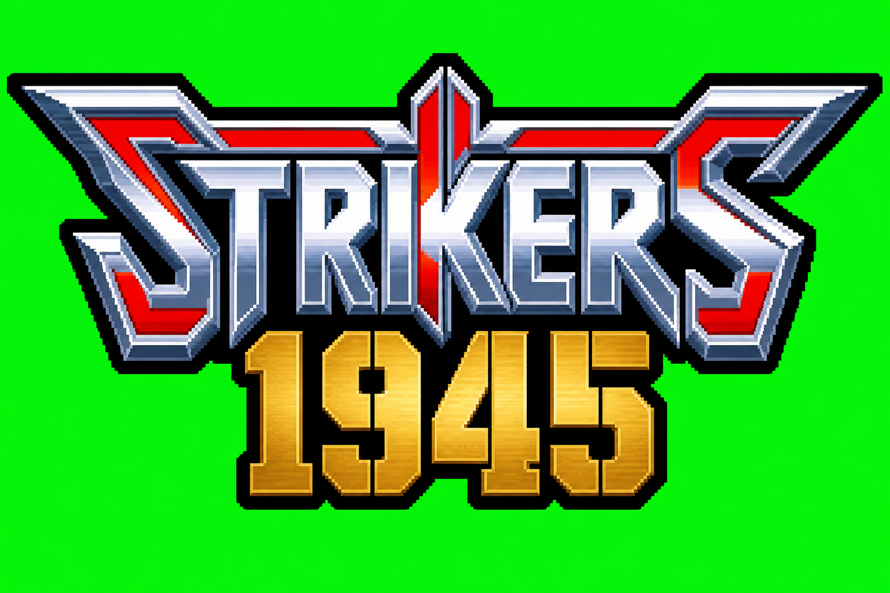
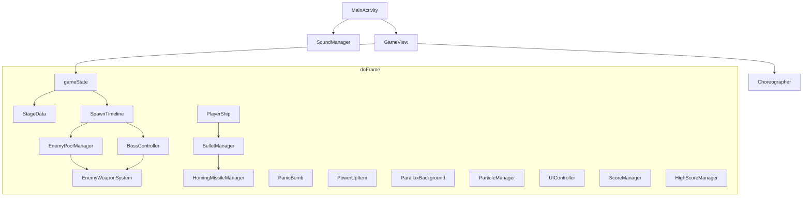

# WW2 Blitz

Portrait Android shoot-’em-up (`com.cc.ww2blitz`). One fighter, six timed stages, peelable bosses. The product is a 1990s arcade cabinet: attract while idle, one linear credit, briefing cards, time-scripted waves, a tiny hitbox, a panic bomb, a recap ticker, and three-letter name entry.

The software is a Kotlin engine on one `SurfaceView`, clocked by `Choreographer`. Combat is not a Compose tree. The hot path does not allocate.

  

Every architectural chapter below uses the same shape: **need** (what a 90s cabinet had to do), **choice** (the rule this engine adopted), **why** (how that rule satisfies the need without fighting Android), **implementation** (where and how the code does it).

---

## Catalog of architectural choices

This is the full inventory. Nothing in the engine is “just a UI preference”; each row is a cabinet constraint.

| # | Need | Choice | Chapter |
| --- | --- | --- | --- |
| 1 | One OS window, stay awake, music keys | Immersive `Activity`, `FLAG_KEEP_SCREEN_ON`, `STREAM_MUSIC` | [Host](#1-host-activity) |
| 2 | Tick with the glass, not a widget tree | `SurfaceView` + `Choreographer` + hardware canvas | [Frame loop](#2-frame-loop) |
| 3 | No GC hitch in a bullet hell | Zero heap on `doFrame`; fixed pools; `while` loops | [Zero allocation](#3-zero-allocation) |
| 4 | One object knows the scene | `GameView` owns `gameState`; departments do not | [Scene owner](#4-scene-owner) |
| 5 | Cheap, allocation-free scenes | `gameState` is an `Int`, not an enum | [Scene machine](#5-scene-machine) |
| 6 | Cabinet sells itself while idle | Attract cycle: title 4 s → CPU demo 30 s → ranking 4 s | [Attract](#6-attract) |
| 7 | Demo must look like the real game | Same spawn/combat path; `STATE_DEMO`; no leaderboard insert | [Attract](#6-attract) |
| 8 | One credit, no stage-select grid | `STAGE_SEQUENCE` int array; finish is a latch past last index | [Playlist](#7-playlist-and-stage-identity) |
| 9 | Maps have identities, not playlist slots | Flags on `StageData` (`isStage1Script` … `isStage6Backdrop`) | [Playlist](#7-playlist-and-stage-identity) |
| 10 | Operator dipswitch for hardness | Nested `Difficulty` enum: speed, interval, burst, score × | [Difficulty](#8-difficulty-dipswitch) |
| 11 | Operator dipswitch for ship | Persisted `chosen_fighter`; `applyFighterConfiguration` | [Fighter](#9-fighter-dipswitch) |
| 12 | Settings survive power cycle | `SharedPreferences` primitives, load once, `apply()` | [Persistence](#10-persistence) |
| 13 | Sell the next map, freeze combat | `STATE_INTERSTITIAL`, 3 s, timer only | [Briefing](#11-briefing-interstitial) |
| 14 | Thumb must not hide the plane; finger must not run away from it | Arcade rubber band (thumb leash): chase `finger − grabOffset`, 40 px error cap, class speed | [Player motion](#12-player-motion) |
| 15 | Bank must read at a glance | Seven-frame strip, lerp toward hard left or hard right | [Player motion](#12-player-motion) |
| 16 | Hold-to-fire, two ship identities | Class vulcan in `BulletManager`; no trig on the fire path | [Vulcan](#13-vulcan-and-missiles) |
| 17 | Missiles are a power reward, not the gun | Separate missile cooldown at weapon power ≥ 3 | [Vulcan](#13-vulcan-and-missiles) |
| 18 | Bomb must not fire from vulcan taps | Double-tap window + slop; discrete `PanicBomb` | [Bomb](#14-panic-bomb) |
| 19 | Bomb must clear without deleting a core | DPS + per-frame bank, cap, AABB vs pools | [Bomb](#14-panic-bomb) |
| 20 | Sprite is large; hurtbox is a dot | 6 px core, 24 px graze ring, Euclidean test | [Graze](#15-core-hitbox-and-graze) |
| 21 | Graze is a skill drip, once per shot; a chip must not abort the ring | `FLAG_GRAZED` latch; one `takeDamage` per frame; loop only dies on explode | [Graze](#15-core-hitbox-and-graze) |
| 22 | Chip damage ≠ credit over | 3 lives × 3 hits; `GAME OVER` only if `isGameOver()` | [Lives](#16-lives-hits-respawn) |
| 23 | Hardware sprite RAM, not `new` | Fixed pools: enemies 48, enemy shots 720, player shots 100, … | [Pools](#17-sprite-ram-pools) |
| 24 | Never clobber a live sprite | `MAX_ACTIVE` skip; deactivate rather than overwrite | [Pools](#17-sprite-ram-pools) |
| 25 | Waves have a rhythm independent of skill | Clock + one-shot flags, not “spawn when empty” | [Director](#18-time-scripted-director) |
| 26 | Boss must not share the screen with infinite fodder | Freeze `elapsedTime` at the gate (`locksElapsedAtBoss`) | [Director](#18-time-scripted-director) |
| 27 | Formations must be readable, not random scatter | Related pool slots + pattern ids; no Formation object | [Formations](#19-formations) |
| 28 | Silhouettes stay readable on a phone | Four enemy types; complexity in *when* and *pattern* | [Formations](#19-formations) |
| 29 | Aim, lead, revenge scale with the dip | Primitive aim/lead/slop; revenge on Very Hard+ | [Grunt combat](#20-grunt-combat-and-aim) |
| 30 | Killing a gunship must feel like peeling a machine | Multi-hitbox `BossComponent`; derived core vulnerability | [Boss peel](#21-boss-peel) |
| 31 | Armor hits must confirm without a white flash | 2 px micro-shudder, 0.08 s | [Hit confirm and camera](#22-hit-confirm-and-camera) |
| 32 | Cabinet kick on phase/death | Shake/flash as durations + LCG translate; HUD unshaken | [Hit confirm and camera](#22-hit-confirm-and-camera) |
| 33 | Stage 5/6 roof occludes hostiles, not you | Floor → enemies/boss/shots → canopy → player | [Theaters](#23-theaters-and-z-order) |
| 34 | Painted maps must not stretch | Cover-scale parallax; title is a still, center-cropped | [Theaters](#23-theaters-and-z-order) |
| 35 | Green key at authoring time | Punch chroma once at bitmap load | [Chroma](#24-green-chroma) |
| 36 | Recap must be readable | Sweep all combat pools on `STATE_CLEAR` | [Score and recap](#25-score-and-recap) |
| 37 | Bonus roll like a cabinet ticker | Four-phase recap; combat × dip; recap lines unscaled | [Score and recap](#25-score-and-recap) |
| 38 | Kill must tick the HUD without replacing medals | Token 100 / 300 / 1_000 × dip + popup; medals stay the skill money | [Score and recap](#25-score-and-recap) |
| 39 | Power carries; death resets gun | Weapon power persists on continue; `takeDamage` sets power 1 | [Score and recap](#25-score-and-recap) |
| 40 | Ten-row table, no JSON on attract | `IntArray` / `CharArray`, in-place insert, `arcade_leaderboard` | [Name entry](#26-name-entry-and-campaign-end) |
| 41 | Finish is the playlist latch, not “stage id 6” | `campaignFinishedLatch` → credits → qualify | [Name entry](#26-name-entry-and-campaign-end) |
| 42 | Gunshots immediate, music gapless, nothing on the frame | `SoundPool` + dual `MediaPlayer`; volumes in prefs | [Audio](#27-audio) |
| 43 | Collisions need every pool; fat gunships must take body hits | `GameView.resolveCollisions`; shots ellipse `10 + 0.55×half`; player stays a dot | [Collisions](#28-collision-ownership) |

---

## 1. Host activity

**Need.** A cabinet has one glass, never sleeps, and routes volume to the game. Android’s default is a composable UI that can pause, letterbox, and steal keys.

**Choice.** A single immersive `Activity` that owns the window and audio lifetime, then hands pixels to `GameView`.

**Why.** One content view means one canvas and one input stream. Keeping the screen on and binding `STREAM_MUSIC` matches “the machine is on.” Pause/destroy is where volumes are saved and `SoundPool`/`MediaPlayer` die, so combat never constructs audio objects.

**Implementation.** `MainActivity.onCreate`: `requestedOrientation = PORTRAIT`, `setDecorFitsSystemWindows(false)`, hide system bars, `FLAG_KEEP_SCREEN_ON`, `volumeControlStream = STREAM_MUSIC`, `SoundManager.instance.initialize(this)`, `setContentView(GameView(this))`. Manifest: `screenOrientation=portrait`, `resizeableActivity=false`, `appCategory=game`, plus Android 16 large-screen opt-outs so tablets do not ignore the portrait lock. `onPause` saves audio and pauses; `onResume` resumes; `onDestroy` releases. No fragments, no Compose. Viewport size is applied once through `applyViewportSize`: first valid size boots the title stage; later same-size `surfaceChanged`/`onSizeChanged` pairs do not rewind attract or teleport the ship. `surfaceCreated` does not reset the attract cursor.

---

## 2. Frame loop

**Need.** A 90s board ticked with the CRT. A hitch or a huge `dt` after a debugger pause teleports every bullet. Compose “recompose this tree” is the wrong clock.

**Choice.** `GameView` implements `SurfaceHolder.Callback` and `Choreographer.FrameCallback`. `dt` is nanoseconds converted to seconds and **clamped**. API 26+ locks a hardware canvas.

**Why.** Vsync is the cabinet’s scanline analog. Clamping `dt` (50 ms / `MAX_FRAME_NS`) bounds simulation when a frame is late. Hardware canvas keeps blit on the GPU path. `setWillNotDraw(true)` avoids a second software `onDraw`.

**Implementation.** `surfaceCreated` sets `running`, zeros `lastNanos`, `postFrameCallback`. `doFrame` computes `dt`, runs the `when (gameState)` update, draws, `unlockCanvasAndPost`, posts the next callback. `surfaceDestroyed` removes the callback. Departments receive the same `dt`. Title / difficulty / character select do **not** tick parallax. Interstitial only decrements `interstitialTimer`. Play tick order: parallax → **thumb leash** (`followTether`) → `player.update` → player bullets/missiles → pickups (medal magnet) → floating scores → timeline → enemies → boss → enemy shots → bomb → particles → collisions → boss FX flags → clear. Demo uses `demoPilot` / `steerToward` instead of the leash.

Paint: optional world `save`/`translate`/`restore` for shake → background → sprites → flash quad → HUD.

---

## 3. Zero allocation

**Need.** Android’s GC pausing a 720-bullet frame feels like lag. Cabinets did not have a garbage collector on the scanline.

**Choice.** `doFrame` must not allocate. Combat objects exist at construct time. HUD text is one `StringBuilder` plus `CharArray` buffers. Loops are indexed `while`. No `enum.values()`, no `String.format`, no boxing on the hot path.

**Why.** Fixed RAM is how sprite hardware worked. If a feature needs a list, it was the wrong feature for the frame.

**Implementation.** Pools are `Array(N) { Slot() }` created with the manager. Spawn writes fields on an inactive slot. Bitmap decode and `keyGreen` run at load. Recap HUD is `UIController` filling preallocated chars. Difficulty tap indexes `difficultyTiers[7]`, never `Difficulty.values()`. Hellcat spread uses hardcoded `280.68f` / `-1320.55f` instead of `Math.toRadians` on fire.

---

## 4. Scene owner

**Need.** Title, demo, play, recap, and name entry must share the same world systems without every class knowing “are we on the logo.”

**Choice.** Only `GameView` knows the scene. Departments expose activate / `update(dt)` / `draw` / deactivate.

**Why.** The CPU demo can call the same `SpawnTimeline` and `BulletManager` as a credit. Leaderboard insert is a `GameView` policy, not an enemy policy.

**Implementation.** `GameView` holds the managers as fields. Attract, credit start, `enterGameOver`, interstitial, and recap continue are methods here. `BulletManager` still owns the Euclidean graze loop because that math is one pool vs the player; it takes `awardScore` so demo can spark without paying.

---

## 5. Scene machine

**Need.** Many mutually exclusive cabinet screens, switched every frame, with no object per screen.

**Choice.** `gameState: Int` constants. Attract is a **second** int (`ATTRACT_*`) plus `attractCycleTimer` so title/demo/ranking do not need extra activities.

**Why.** `when` on an int is free. Nested attract inside title/demo avoids exploding the state table. Dipswitch menus (`STATE_DIFFICULTY_SELECT`, `STATE_CHARACTER_SELECT`) are scenes that **must not** start a credit.

**Implementation.**

| Constant | Scene |
| --- | --- |
| `STATE_TITLE` (0) | Still, logo, 1P START (visual), audio / difficulty / fighter hits |
| `STATE_PLAYING` (1) | Campaign |
| `STATE_CLEAR` (2) | Swept map + recap |
| `STATE_GAMEOVER` (3) | Death pause (~9 s, tap skip) |
| `STATE_DEMO` (4) | CPU attract |
| `STATE_REGISTRATION` (5) | Three initials |
| `STATE_CAMPAIGN_COMPLETE` (6) | Credits |
| `STATE_INTERSTITIAL` (7) | Briefing, 3 s |
| `STATE_DIFFICULTY_SELECT` (8) | Difficulty list over the still |
| `STATE_CHARACTER_SELECT` (9) | Fighter panels; return only via `[ RETURN TO TITLE ]` |

Empty-glass tap on title calls `beginCampaignFromMenu()` only after settings / difficulty / fighter `RectF`s miss. Those rects are expanded with `inset(-60, -30)` so a miss does not burn a credit. Character-select plane taps mutate `selectedFighterIndex` + `applyFighterConfiguration` + prefs and **do not** change `gameState`.

---

## 6. Attract

**Need.** A 1996 cabinet in a dark arcade must look busy: logo, a CPU flying the real game, then names of people who were good.

**Choice.** Timed cycle on the same engine. Demo uses combat code. Demo score is forbidden from the table.

**Why.** A fake “attract-only” spawn list would desync from the product. Reusing the director means the window always shows shippable waves. Forbidding insert keeps the operator table honest.

**Implementation.** `ATTRACT_TITLE_SECS = 4`, `ATTRACT_DEMO_SECS = 30`, `ATTRACT_HIGH_SCORE_SECS = 4`. On title timeout, `beginDemo()` picks stage `1…5` with an LCG, skipping `lastDemoStage`. Stage 6 is never attract. `demoPilot` steers toward the lowest living enemy or boss part, sidesteps nearby downward bullets, sine-wanders if idle (`DEMO_SPEED`). `resolveEnemyBulletsVsPlayer(..., awardScore = false)`. Touch on demo or ranking returns to interactive title. Surface recreate does **not** force `ATTRACT_TITLE`; ranking can survive a flap. `HighScoreManager` insert is not called on this path.

---

## 7. Playlist and stage identity

**Need.** A credit is a linear war, not a level-select app. Test playlists may repeat an id. “You beat stage 6” is not “the playlist is done” if 6 appears twice.

**Choice.** `STAGE_SEQUENCE` is an `IntArray`. Finish is `campaignFinishedLatch` after `advanceToNextStage()` walks **past the last index**. Directors and theaters key off **identity flags**, not playlist index.

**Why.** Index-based finish is what the operator programmed. Identity flags let Stage 5’s canopy and Stage 3’s freeze work even if you reorder the array.

**Implementation.** Default `intArrayOf(1, 2, 3, 4, 5, 6)`. `setCurrentStage` / `resetToStart` / `advanceToNextStage` maintain `sequenceIndex` and `stageId`. Flags: `isStage1Script` … `isStage6Backdrop`, `hasOverlayClouds`, `locksElapsedAtBoss`, `usesOpeningPowerV`. `applyStageMetrics` writes `scrollSpeedY`, `targetBossTimelineSeconds`, `stageMusicTrack`. `GameView.bootLaunchStageIfNeeded` runs **once** on the first valid viewport so attract starts on stage 1 with empty pools. Later title size bounces do not call it; `returnToTitle` / `beginDemo` reset the cursor themselves.

Stage table (metrics as coded):

| Stage | Theater | Scroll | Boss cue |
| --- | --- | --- | --- |
| 1 | Canyon / clouds | ~180 | ~38 s |
| 2 | Super-tank country | ~260 | ~30 s |
| 3 | Ocean | ~200 | ~25 s |
| 4 | Jungle | fastest | ~45 s |
| 5 | Facility | 280 → 0 at gate | ~45 s |
| 6 | Clouds → space → orbit | envelope then brake | **5 s**, no grunts |

---

## 8. Difficulty dipswitch

**Need.** Psikyo cabinets had a pot: tutorial through gauntlet. Changing it must not allocate, must not start a credit, and must scale speed, cadence, density, aim, and score together.

**Choice.** Nested `StageData.Difficulty` with `index`, `speedMultiplier`, `intervalDivider`, `burstBonus`. Live instance (`liveInstance`) so pools read the dip without a `GameView` pointer. Seven constants in a `GameView` array for tap.

**Why.** Three floats cover the whole combat table. Score uses a parallel multiplier on `ScoreManager`. Recap line items stay raw so the ticker is not double-scaled.

**Implementation.** Saved as `target_difficulty`. `saveDifficultySetting` writes prefs and the live enum. Combat: grunt shot speed × multiplier; spawn/refire delays ÷ `intervalDivider`; heavy ring `12 + burstBonus`; interceptor fan `1 + burstBonus`. Monkey/Easy: ±0.15 rad slop via `nextUnit()`. Very Hard+: first-order lead from sampled player velocity (two floats on the pool). Hard+: kamikaze `steerToward`. Very Hard+: revenge aimed shot on grunt death; Hardcore heavies a 3-way (death-clear ships skip so cancel radius does not eat the round). Boss muzzle speeds and timer resets in `EnemyWeaponSystem` use the same two floats. `syncDifficultyMultiplier` on stage reset / boot.

| Index | Label | Speed | Interval | Extra shots | Score × |
| --- | --- | --- | --- | --- | --- |
| 1 | MONKEY | 0.65 | ÷ 0.75 | −1 | 0.5 |
| 2 | EASY | 0.85 | ÷ 0.90 | 0 | 0.8 |
| 3 | NORMAL | 1.00 | 1.00 | 0 | 1.0 |
| 4 | HARD | 1.15 | ÷ 1.15 | 0 | 1.2 |
| 5 | VERY HARD | 1.30 | ÷ 1.25 | +1 | 1.5 |
| 6 | EXPERT | 1.45 | ÷ 1.40 | +1 | 2.0 |
| 7 | HARDCORE | 1.60 | ÷ 1.55 | +2 | 3.0 |

---

## 9. Fighter dipswitch

**Need.** Two planes with different guns and handling, chosen before the credit, remembered after a reboot—like a ship select that is not a second campaign start.

**Choice.** Integer 0/1 on `PlayerShip.chosenFighterIndex`, applied through `applyFighterConfiguration`, persisted as `chosen_fighter`. Selecting a panel does not leave `STATE_CHARACTER_SELECT`.

**Why.** Mutating live stats + sprites in one function keeps demo, play, and title tags coherent. Staying in the select scene matches difficulty: dip first, credit from the title.

**Implementation.** P-38: `player_ship_1…7`, `classBaseSpeed` 1600, `responsivenessTether` 1.0, fire 0.090 s, dual columns. Hellcat: `player_b_1…7`, speed 1150, tether 0.82, fire 0.125 s, 3-way. `applyFighterConfiguration` recycles the seven frames, `loadFrames()`, `refreshDrawSize()`. `GameView` init loads prefs then applies. Panel tap saves immediately. Gold focus stroke (4 px, 8 px corners, blinking alpha) reads `selectedFighterIndex`, synced from `chosenFighterIndex` when the scene opens.

---

## 10. Persistence

**Need.** Operator settings and the ranking table must survive process death. Attract must not parse JSON.

**Choice.** Primitive prefs. Arcade dips in `shmup_arcade_settings`. Audio in `StrikersAudioPrefs`. Leaderboard in `arcade_leaderboard`. Load once (`hydrated` on scores).

**Why.** Ten ints and thirty chars are a cabinet EEPROM. `edit().apply()` is fire-and-forget off the frame.

**Implementation.** `StageData.initPersistentSettings` reads difficulty index and fighter 0/1. `HighScoreManager` keeps `topScores`, `topNames` (length 30), `topStages`; insert shifts in place. Fallback names (`PSK`, `STK`, …) exist before first hydrate. Audio load/save is synchronized inside `SoundManager`.

---

## 11. Briefing interstitial

**Need.** Cabinets flashed a mission card before the map. Combat and attract must not run under it.

**Choice.** Dedicated `STATE_INTERSTITIAL`. Touch swallowed. Timer 3 s, then `STATE_PLAYING`.

**Why.** A flag on the play state would still tick bullets. A full state makes the freeze obvious and the draw path a single card.

**Implementation.** `INTERSTITIAL_SECS = 3`. Title start and recap-continue (when not finished) assign it. `UIController.loadInterstitials` decodes six native-aspect PNGs once (1080×2400). Draw **contains** the card (`min(scaleW, scaleH)`), centers it, and fills letterbox from the card’s top-left pixel so short tablets keep side bars instead of cropping the header. Gold `OPERATION:` + name sit at `cardTop + 4.2 × textSize` (always on-screen). Fade from remaining timer. `syncBgm` uses the **stage** track during interstitial so the card and the fight share music.

---

## 12. Player motion (thumb leash)

**Need.** Putting the plane under the thumb hides the sprite. Relative drag (ship += finger delta) lets the finger run away: the plane is no longer where you are pointing, and a 40 px clamp on **that delta** never acts like a leash. Cabinets and phone STGs treat the stick/thumb as a **rubber band to a grab point**.

**Choice.** Arcade rubber band. On a grab inside `touchGrabRadius`, store `grabOffset = finger − ship`. Every play frame, the target is **`finger − grabOffset`** (grab the wing, the plane does not jump under the thumb). `PlayerShip.followTether` chases that target. Error longer than `TETHER_LIMIT_PX` (40) is scaled down to 40 px — that is the throw of the leash, **ship vs target**, not “this `ACTION_MOVE` sample.” Then `maxMove = classBaseSpeed * dt`; if the (already leashed) step is still over budget, scale it and multiply Hellcat by `responsivenessTether` 0.82. Inside the budget the ship sits on the target (1:1 micro-dodges). `clamp()` in the same call so a bezel hit drops leftover error. Touch only **writes** the current finger; motion is applied **once** in `doFrame` so extra MOVE events cannot buy extra speed.

**Why.** The leash is what the operator’s hand expects: the plane wants to stay at the same offset from the thumb. A flick stretches the band; the ship catches up at class speed instead of teleporting or being left in another county. Hellcat 0.82 is weight on **over-budget** chases only. P-38 1.0 stays instant at the cap. Grab-offset is why you can hold the boom and still see the nose.

**Implementation.** `ACTION_DOWN` that hits the grab disk sets `isDraggingShip`, `grabOffsetX/Y`, and `steerFingerX/Y`. `ACTION_MOVE` updates the finger for `dragPointerId` only. `doFrame` (`STATE_PLAYING`) calls `applyShipTether` → `followTether(finger, offset, dt)` **before** `player.update`. Early-out if error ≤ 0.001. If `dist > 40`, `dx,dy *= 40/dist`. If `dist > maxMove`, `x/y += dx * (maxMove/dist) * responsivenessTether`; else `x/y += dx, dy`. Bank: `|dx| > MOVE_THRESHOLD`. Demo still uses `steerToward` at `DEMO_SPEED` (no leash). Lift finger: `isDraggingShip = false`; vulcan hold is `PlayerShip.isDragging` from `onTouch`.

| | P-38 | Hellcat |
| --- | --- | --- |
| `classBaseSpeed` | 1600 | 1150 |
| `responsivenessTether` | 1.0 | 0.82 |
| Over-budget flicks | Full speed scale | 82% of the speed scale (weight) |
| Micro-dodges | 1:1 | 1:1 |

---

## 13. Vulcan and missiles

**Need.** Hold-to-fire was standard. Two ships must *play* differently. Homing is a power-up, not the default stream. Fire must not allocate or run trig every shot.

**Choice.** `BulletManager` owns cooldown and spawn. Pattern branches on `chosenFighterIndex`. Missiles are a second timer at power ≥ 3.

**Why.** One pool, two recipes. Hardcoded Hellcat components (`±280.68`, `-1320.55` at 1350 speed, 12°) avoid `toRadians`/`cos` on the fire path. Separate missile cadence (`MISSILE_INTERVAL = 0.480`) keeps vulcan rhythm class-specific.

**Implementation.** While `isFiringHeld()` and `fireCooldownTimer <= 0`: `spawnWeaponStream`, reset timer to `player.vulcanInterval()`. P-38: two slots at `x±18`, `y-10`, `vx=0`, `vy=-1600`. Hellcat: three slots at `x`, `y-15`; center `vy=-1350`; flanks the precomputed vectors. `spawnPlayerBullet` walks the 100-slot pool for `!isActive`. Power ≥ 3: two homing missiles from `x±30` with seed velocities; 8-slot missile pool seeks nearest on-screen enemy or living boss part. Vulcan SFX on stream spawn.

---

## 14. Panic bomb

**Need.** A bomb is a rare panic, not a second vulcan. Same tap as fire would dump stock. A 0.5 s blast must not delete a boss core through armor in one frame, nor tickle it.

**Choice.** Double-tap (280 ms, pixel slop) spends one of three bombs. Damage is DPS accumulated in a float bank, applied as ints, AABB vs enemies/boss parts, shots cancelled inside the blast rect.

**Why.** Gesture isolation is how cabinets separated buttons. DPS+bank is frame-rate stable. Cancelling bullets is the Psikyo bomb language.

**Implementation.** `GameView.onTouchEvent` on `ACTION_UP` compares time/distance to `lastTapUpMs`. `PanicBomb.activate` at player XY; 6 frames × 0.083 s. `updatePanicBomb` grows `bombDstRect`, deactivates enemy shots inside it, `enemyBombDmgBank += BOMB_ENEMY_DPS * dt` (250), same idea for boss (`bossBombDmgBank`) with a cap so an open core is not deleted in one pulse. Heavies shudder on bomb chips. Extra **B** at 3 stock pays `BOMB_FULL_SCORE` (5000) + popup; extra **P** at power 3 pays `POWERUP_FULL_SCORE` (2000, medal face) + popup. Neither is discarded.

---

## 15. Core hitbox and graze

**Need.** If the whole sprite were solid, weaving would be impossible. Psikyo drew a generous plane and killed you on a **dot**. Sliding a bullet through the halo is a skill check with a score drip, not a second life.

**Choice.** Two radii on the same center: core 6 px, graze 24 px. Euclidean test. Graze latches once per bullet. **One damage event per frame**; the shot loop does not return on a chip or i-frame spark. Rams/pickups keep a larger body radius.

**Why.** Distance-squared avoids `RectF.intersects` and sqrt on the miss path. A flag on the bullet is the EEPROM of “already paid.” Cabinets chip you once per pulse, then still pay graze on the rest of the ring. Returning from the first overlap skipped stacked shots and i-frame grazes.

**Implementation.** `BulletManager.resolveEnemyBulletsVsPlayer`: skip if `!player.isOnField()`. For each active `EnemyBullet`, if `FLAG_LASER` use AABB (`S6_LASER_HW/HH` + core); else `distSq` vs `coreSq` then `grazeSq`. Core/laser overlap: deactivate the shot. If `damagedThisFrame` is still false, set it and `takeDamage()`; **return true only if the body exploded**. Extra cores/lasers the same frame are cancelled with no second chip (i-frames included). The loop continues so remaining pellets can graze. Graze: set `FLAG_GRAZED`, `addGrazeScore` if `awardScore`, `triggerSpark` with outward velocity from the delta. Demo passes `awardScore = false`. Graze **count** for recap is incremented unscaled.

---

## 16. Lives, hits, respawn

**Need.** Cabinets chip a shield bar, then explode a life, then GAME OVER. Blowing the sprite with lives left is not the end of the credit.

**Choice.** `lives` (3) × `hitsLeft` (3). `takeDamage` returns true when **this body exploded**, not only when the credit is dead. `GameView` enters GAME OVER only if `player.isGameOver()`.

**Why.** Separating explosion from credit-over lets respawn, invuln, and HUD stay honest. Callers that treated `takeDamage() == true` as game over would skip remaining lives.

**Implementation.** Invuln or respawn timer: ignore hits. Decrement hits; if hits remain, 2 s invuln, return false. Else spend a life, reset hits, **weapon power = 1**, `respawnTimer = 0.4 s`; if lives == 0 set `isGameOverFlag`. After respawn, snap to `(0.5w, 0.78h)` and invuln. `isOnField()` is false during respawn/game over so bullets do not chew a ghost. Shield pickup calls `restoreHits()`.

---

## 17. Sprite-RAM pools

**Need.** Hardware had N sprites. `new Enemy()` per spawn would hitch and fragment.

**Choice.** Fixed arrays, inactive flag, linear scan. If the timeline would exceed a safety cap, **skip** the spawn.

**Why.** Skip-beats-overwrite: a dropped drone is better than a live heavy teleporting. Caps (`MAX_ACTIVE = 10` on the director vs 48 physical slots) keep overlap readable.

**Implementation.**

| Pool | Size | Slot |
| --- | --- | --- |
| Enemies | 48 | `Enemy` |
| Enemy bullets | 720 | `EnemyBullet` |
| Player bullets | 100 | `PlayerBullet` |
| Missiles | 8 | `Missile` |
| Explosions | 28 | `ActiveExplosion` |
| Graze sparks | 48 | `GrazeSpark` |
| Pickups | 48 | `PowerUpSlot` |

`spawnEnemy` / `fireBullet` / `spawnPlayerBullet` find `!isActive`, write primitives, set active. Off-screen cull deactivates. `deactivateAll` on stage boot, demo start, and `sweepPlayfieldForClear`. Some heavies set `deathClearBullets`; on death, nearby enemy shots deactivate (cancel medals on Stage 5 freeze).

---

## 18. Time-scripted director

**Need.** Designers said “at 8 seconds, a V.” If the next wave waited until the screen was empty, experts skipped content and novices stalled. A hitch must not double-fire a wave.

**Choice.** `SpawnTimeline.elapsedTime += dt`. Threshold + boolean latch. Stages 3–5 freeze the clock at the boss gate. Stage 6 is intro-only.

**Why.** Clock = cabinet rhythm. Latch = one-shot even if `elapsedTime` jumps the threshold. Freeze = the fortress is the content.

**Implementation.** `update` sets `activeStage` from `StageData`. Stage 6: increment until `S6_INTRO_SECS` (5), `beginEntranceForStage(6)`, latch, return. Else increment unless `locksElapsedAtBoss && bossCueFired`. Opening power-V on stages that `usesOpeningPowerV`. Flags: `vFormSpawned`, `wallSpawned`, `s2KamiDiamondSpawned`, … `countActive() >= MAX_ACTIVE` breaks inner spawn loops. `reset()` zeros the clock and flags. Stage 5 ramps `scrollSpeedY` 280→0 between 40–45 s with no spawns, then cues the engine.

---

## 19. Formations

**Need.** Players learn shapes: “that V will hold and shoot,” “those lanes weave,” “that wall is bomb bait.” Random independent spawns are noise. A leader-follower graph allocates and desyncs.

**Choice.** No `Formation` type. Spawn several `Enemy` slots at related positions with the same `pattern` (or diamond flags on the slot). Four types only.

**Why.** The *look* of a V is three interceptors + `PATTERN_V_HOLD`. Follow-the-leader is extra RAM and extra bugs. Four silhouettes stay readable at phone size; complexity lives in the clock.

**Implementation.** Types: `TYPE_DRONE`, `TYPE_KAMIKAZE`, `TYPE_INTERCEPTOR`, `TYPE_HEAVY`. Patterns: `PATTERN_V_HOLD` (descend, `aiPhase` hold, then aim), `PATTERN_WEAVE` (sine on `homeX`), `PATTERN_DIAGONAL_SWEEP`. Diamond: `diamondLeader` / `diamondWingSign`. Motion in `EnemyPoolManager.update` (`updateInterceptorHold`, weave, kamikaze `steerToward` on Hard+).

Jobs by stage: Stage 1 teach (sweep V that drops **P**, flanks, hold V, weaves, twin heavies). Stage 2 deny camping (pincers, death-clear heavies, diamond, staggered walls). Stage 3 scouts + cruiser. Stage 4 width + charge walls. Stage 5 facility approach then freeze. Stage 6 empty.

Deliberately not done: steering groups, twelve enemy classes, random scatter inside a wave shape, spawn when pool full.

---

## 20. Grunt combat and aim

**Need.** Shots must aim, sometimes lead, sometimes miss (Monkey), and on high dips punish kills with revenge—without allocating a bullet factory.

**Choice.** Each `Enemy` holds `aimVx/aimVy`, burst counters, `writeAimedShot` with optional lead and slop. Fire goes through `EnemyWeaponSystem.fireBullet` into the 720-pool. Difficulty scalars apply at fire-delay and speed write time.

**Why.** Aim is a few floats on the slot. Lead is `eta = dist/shotSpeed` times sampled player velocity (two floats on the pool, reset with `deactivateAll`). Revenge is a branch in `resolveCollisions` / death, not a new system.

**Implementation.** `scaledFireDelay()` uses `intervalDivider`. Interceptors on hold use `HOLD_FIRE_GAP`. Heavies fire rings `12 + burstBonus`. `writeAimedShot` uses `atan2` + `cos`/`sin` once when the burst is *aimed*, not per frame for every idle ship. Lasers are the same `EnemyBullet` with `FLAG_LASER` and a larger cull AABB (Stage 6).

---

## 21. Boss peel

**Need.** A single HP sponge feels wrong. Shooting guns off a machine, then the core, is the 90s language. Core must ignore damage until the guns are gone (or take reduced damage while flanks live).

**Choice.** One illustration, many `BossComponent` slots with HP. `isCoreVulnerable()` is derived. Wreck bitmaps overlay destroyed modules. Per-stage fire is timers in `EnemyWeaponSystem.updateStageNBoss`.

**Why.** Derived vulnerability is one rule: you cannot cheese the core. Shared bullet pool means boss patterns are data (angles, intervals), not object graphs.

**Implementation.** `BossController` binds a stage, runs entrance, then combat. Hits that are not core-open bounce (or Stage 5: half damage while both flanks live). Flanks 150/150, core 350 on Stage 5; break +25k and a guaranteed drop (left **P**; right **P** if power < 3 else bomb/shield); core +100k and 4.5 s victory (freeze, bullets→medals, cascade, white flash, wreck center). Stage 6: rails then lens; cyan triples / pink column / helix in `updateStage6Boss`. Stages 1–4: last gun → `FX_PHASE` flash/shake; core death → `FX_DEATH`, explode overlay, then sweep. `GameView` consumes those flags after collisions. Bomb DPS uses the same parts array.

---

## 22. Hit confirm and camera

**Need.** Armor must jolt when a round lands. Painting the sprite white fights the outline look. A turret falling off should kick the cabinet; HUD numbers must stay readable.

**Choice.** Micro-shudder (±2 px, 0.08 s) on heavies and boss parts. Screen shake/flash are **durations** on `GameView`, not particle objects. World draws inside `translate`; HUD after `restore`.

**Why.** Shudder is local and cheap. Duration+LCG is the same RAM every frame. Unshaken HUD is a cabinet HUD on a rattling monitor.

**Implementation.** `triggerMicroShudder` sets `shudderTimer`. Draw `save` / `translate(±SHUDDER_AMPLITUDE, 0)` ping-pong `(timer * 100).toInt() % 2` / `restore`. Boss: one welded blit shudders as a whole. `triggerScreenShake` / `triggerScreenFlash` / `triggerWhiteFlash` write floats; `dx, dy` from an LCG mapped to `[-1,1] * intensity`. Flash is a reused full-screen quad (~40% white, `SRC_OVER`). Bombs call `addScreenShake`. Drones/kami/interceptors do not shudder.

---

## 23. Theaters and z-order

**Need.** Painted maps are ~2:3. Stretching them on a tall phone melts hangars. Stage 5/6 have a roof that should hide **enemy** craft, not the player. The title must sell the product, not scroll a canyon behind the logo.

**Choice.** Cover-scale parallax (uniform scale, crop overflow). Title is a center-cropped still. Stage 5/6 draw floor, then hostiles, then canopy, then player/shots/HUD.

**Why.** Cover preserves proportions. Z-order is the 1942 “you fly under the bridge” trick. A still title is an attract card.

**Implementation.** `ParallaxBackground` cover-scales layers; mid/high clouds `PorterDuff.SCREEN`. Stages 2–4 swap ground bitmaps only. Stage 5: floor at `scrollSpeedY`, keyed canopy at 1.5×. Stage 6: cloud floor, recycle/swap to space at 30 s (`S6_SPACE_SWAP_AT`), orbit overlay from 35 s (`S6_CANOPY_AT`), speed envelope in `updateStage6`. Title: `max(scaleX, scaleY)` into reused `titleDstRect`. Overlay clouds (`hasOverlayClouds`) are Stage 1 identity.

---

## 24. Green chroma

**Need.** Pixel art is painted on screaming green. Requiring authored alpha for every bank frame is an export tax.

**Choice.** Decode mutable `ARGB_8888`, punch `g > 160 && g > r+40 && g > b+40` to 0 once at load.

**Why.** Load hitch is acceptable; per-blit keying is not. Same helper on player, enemies, bosses, missiles, explosions, Stage 5 canopy (`#00FF00`). The title still (`title_screen_backdrop`) is **not** keyed — it is a photograph; green punch would eat olive and cloud pixels.

**Implementation.** `BitmapFactory` `inMutable`, `inScaled = false`. Row buffer `IntArray(width)`, `getPixels`/`setPixels` per row. Recycle on fighter swap and stage theater swap. Title uses `decodeOpaque`.

---

## 25. Score and recap

**Need.** Running score must cap like a cabinet counter. Dip must scale combat payouts. Recap on top of a frozen bullet soup is unreadable. Bonus roll is a ticker, not a dialog. Gun power carries to the next map; death resets it. A wave that only drops medals, with coins still falling, used to leave the HUD frozen — players read that as “score is broken.”

**Choice.** `ScoreManager` singleton, cap 99,999,999. Combat × `activeMultiplier`. Recap lines 50k/20k/500 **unscaled**. On playing→clear, sweep every combat pool. Four-phase recap. Continue does not call `resetWeaponPower`; `takeDamage` on life-loss does. Grunt kills pay a **token** (not a new sprite): 100 drone/kami, 300 interceptor, 1_000 heavy, then × dip, plus the same floating popup as extra P/B. Medals stay the real money.

**Why.** Cabinets always ticked the counter on explode, then paid again if you scooped the gold. A 100-point drone does not rival a 2000-point face medal, so the Psikyo “pick the gold” skill still decides the ranking. The player **sees** the HUD move on every wreck, even if they miss the coin. Demo does not pay (same honesty as graze).

**Implementation.** `addScore` / `scalePoints`. `GameView.onEnemyKilled` (vulcan, missile, bomb, ram — `STATE_PLAYING` only) calls `awardKillScore`: `KILL_SCORE_*` × dip, `campaignScore +=`, `triggerFloatingScore` at the wreck. No extra medal or chip is spawned for the token. Graze count separate. Recap: `PHASE_LIVES` → `BOMBS` → `GRAZE` → `TOTAL` (~1 s each, vulcan click every 5 frames while rolling). `UIController.drawStageClear` from char buffers. `ACTION_UP` when `isRecapReady()`: `resetStageCounters`, `advanceToNextStage`; if latch → `STATE_CAMPAIGN_COMPLETE`, else interstitial. 40% black wash under the card. World sprites not drawn in `STATE_CLEAR`.

Pickups: **P** increments power to 3; extra **P** at max power pays `POWERUP_FULL_SCORE` (2000) + floating popup (`collectPowerUp`), same pattern as extra **B** at 3 stock (`BOMB_FULL_SCORE` 5000 + popup). Falling medals still score face-up 2000 / edge 200 at Normal, then × dip. Shield `restoreHits()`. Stage 5 cancel medals during core-kill freeze. Medals **magnet**: within 96 px they slide toward the ship at 420 px/s; in the outer 10% of the screen, if the plane is hugging that same wall, the pull radius is 188 px so rim coins still collect (the sprite clamp cannot kiss the bezel). P/B are unchanged wall-bounce at 30 px.

---

## 26. Name entry and campaign end

**Need.** Beat 10th place, enter three letters. Finishing the war is credits, then the same qualify path. Finish is “playlist walked off the end,” not “we saw id 6.”

**Choice.** `HighScoreManager` ten rows, in-place insert. `STATE_REGISTRATION` left/right halves of a letter row, lock at the bottom. `STATE_CAMPAIGN_COMPLETE` credits (~22 s) then blink register.

**Why.** CharArray names draw with a `while`. Latch handles duplicate ids in a test sequence.

**Implementation.** `doesScoreQualify`, insert shifts scores/names/stages. Registration: tap left decrements A–Z, right increments, bottom locks one letter, three times, then ranking. Game over ~9 s skippable; if no qualify, skip naming. Credits: `drawCampaignCompleteCredits`, `Paint.breakText` wrap at 85% width.

---

## 27. Audio

**Need.** Vulcan must be instant. BGM must loop without a gap. Neither may `new` during dodge.

**Choice.** `SoundPool` for SFX. Dual `MediaPlayer` + `setNextMediaPlayer` for BGM. Track switch on the main looper. Volumes in prefs.

**Why.** Pool playback is the cabinet PCM channel. Cross-fading players is gapless without allocating a new player on the frame.

**Implementation.** `playSFX` lock + `play`. Title / difficulty / character select → `bgm_title`. Play, demo, interstitial → `stageMusicTrack`. Clear / registration / campaign complete → victory. Stage 5 victory can `stopBGM()`. `syncBgm()` in `GameView` compares `want` vs `lastBgmRes`. Mute stops alarm loop. Pause/resume from `MainActivity`.

---

## 28. Collision ownership

**Need.** Hits involve every pool (player shots vs grunts vs boss parts vs player vs rams vs pickups vs bomb). Splitting that across classes creates order bugs. Graze math is still one tight loop.

**Choice.** `GameView.resolveCollisions` orchestrates. Euclidean core/graze lives in `BulletManager`. Boss/player-shot tests are padded ellipses on parts. Rams use **45%** of enemy half-size plus the player 12 px dot. Vulcan/missiles vs grunts use a slightly fatter ellipse: `SHOT_HIT_PAD` (10) + **55%** of that type’s `halfW`/`halfH`. The player hurtbox stays a dot.

**Why.** One place decides game-over. One place implements Psikyo graze. A shared 28 px disk on the enemy **center** made drones fair and heavies ghost except at the cockpit. Type-scaled shot ellipses let you walk fire across the painted hull without growing the player into a barn.

**Implementation.** `shotHitsEnemy(dx, dy, type)` for vulcan and homing vs the grunt pool. Rams: `PLAYER_HIT_RADIUS + half*ENEMY_RAM_BODY_FRAC` (0.45). Player bullets/missiles vs boss parts (core gated by `isCoreVulnerable()` except Stage 5 half-damage rule). Enemy bullets vs player (`resolveEnemyBulletsVsPlayer`: one chip per frame, graze the rest). Pickups vs player. Then consume boss `FX_*` flags. `enterGameOver` only when `isGameOver()` and `STATE_PLAYING`.

---

## Source map

| Class | Owns |
| --- | --- |
| `MainActivity` | Window, audio lifetime |
| `GameView` | Scene, vsync, attract, credit, collisions, bomb gesture, shake/flash |
| `StageData` | Playlist, dipswitches, theater flags, metrics |
| `SpawnTimeline` | Wave clock, latches, formation cues |
| `EnemyPoolManager` / `Enemy` | Grunt motion, types, patterns, aim |
| `EnemyWeaponSystem` / `EnemyBullet` | Hostile shots, boss fire tables, lasers |
| `BossController` / `BossComponent` | Peel, wrecks, entrance, victory |
| `PlayerShip` | Drag, bank, lives/hits, fighter stats |
| `BulletManager` / `PlayerBullet` | Vulcan, graze vs core |
| `HomingMissileManager` | Power-3 seekers |
| `PanicBomb` | Panic blast animation |
| `PowerUpItem` | P / B / shield / medal slots |
| `ParallaxBackground` | Cover-scaled theaters |
| `ParticleManager` | Explosions, graze sparks |
| `ScoreManager` | Score, graze count, recap phases |
| `HighScoreManager` | Top 10 EEPROM |
| `UIController` | Interstitials, recap HUD, credits |
| `SoundManager` | SFX pool, looped BGM, volume prefs |
