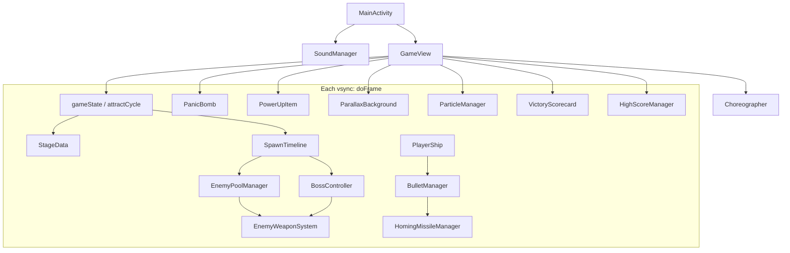

# WW2 Blitz

WW2 Blitz is a **portrait shoot-’em-up** for Android. You fly one fighter up a scrolling WWII landscape, shoot waves of planes, peel a multi-part boss, and carry your score through four stages.

If you have played *1942*, *Strikers 1945*, or a Psikyo cabinet: that is the genre. The phone is held upright. Enemies come from the top. You stay near the bottom.

The software is a small Kotlin engine (`com.cc.ww2blitz`). It does **not** use Jetpack Compose for gameplay. One `SurfaceView` draws every pixel. A vsync callback (`Choreographer`) is the clock. The combat loop is written so it **does not allocate memory every frame**, which keeps Android’s garbage collector from hitching the action.

---

## What you play

### The fantasy, in one paragraph

You are a lone interceptor. The ground scrolls toward you like a map on a conveyor. Flights of enemy aircraft enter in recognizable **formations**—Vs, side sweeps, weaving pairs, walls of heavies. You hold the glass to fire, drag to dodge green bullets, grab a **P** to make the gun wider, and double-tap a **bomb** when a wall is about to crush you. After a few dozen seconds a **boss** fills the top of the screen. You shoot off its guns first; only then will the core take damage. Survive four of those maps and the war is over.

### Why it feels like an arcade, not a “level select” app

A real cabinet in 1996 did three things while nobody was playing: show the logo, play a **demo** with the CPU flying, then show the **high score table**. WW2 Blitz does the same. You do not pick a stage from a menu. You either tap **1P START** and play the campaign, or you watch the machine sell itself.

### Controls (what your thumb does)

**Relative drag** means the ship moves *by how much your finger moved*, not “the ship jumps under your finger.” If you put your thumb on the right side of the screen and slide left a centimeter, the plane moves left a centimeter. That keeps the plane readable and keeps your thumb off the sprite.

**Hold to fire** means you do not tap for every bullet. While the finger is down, a vulcan fires on a timer. Stronger **weapon power** adds extra streams, then **homing missiles**.

**Double-tap** is a separate gesture (short taps close together, little movement). That spends one bomb. A bomb is a short, huge blast used as a panic button, not as your main gun.

**Audio settings** on the title are real sliders for BGM and SFX. They do not start a game.

You start with **3 lives**, **3 hits per life** (a small bar), and **3 bombs**. After a hit you are briefly invincible so a bullet cloud cannot delete three lives in one frame.

### Power-ups and score

Drops are items that fall after certain kills:

- **P (power)** — your shot pattern gets denser. When power is already maxed, extra P becomes a medal (score only).
- **B (bomb)** — another bomb, up to 3. Extra B becomes a medal.
- **Medal** — score. Face-up is worth more (2000) than edge-on (200).

Your running total is `campaignScore`, capped at 99,999,999. When a stage is cleared you also get a **life bonus** (10,000 × lives left) and a **bomb bonus** (5,000 × bombs left). Those numbers tick up on screen like a 1990s scorecard, then you tap to go to the next stage.

### Bosses

A boss is one big illustration, but the engine treats it as **several hitboxes**: left gun, right gun, core, and so on. If you could dump all damage into the core immediately, the fight would be a sponge. Instead you **peel** the modules. Destroyed modules show wreck art. The core only becomes vulnerable when every other part is gone. When the core dies, a short explode animation plays, then stage clear.

| Stage | Theater | How fast the ground moves | When the boss is cued |
| --- | --- | --- | --- |
| 1 | Canyon / airfield | slower | ~38 seconds |
| 2 | Super-tank country | faster | ~30 seconds |
| 3 | Ocean / carrier | medium | ~25 seconds |
| 4 | Jungle air fortress | fastest | ~45 seconds |

The four **grunt types** you see before the boss: **drone** (fodder), **kamikaze** (dives, little shooting), **interceptor** (holds and aims), **heavy** (tanky, slow fire). How they are *arranged* is a design topic of its own—see [Enemy formation design](#enemy-formation-design) below.

### Attract mode (the machine playing itself)

Leave the title untouched:

1. **Title (~4 s)** — logo and blinking **1P START**.
2. **CPU demo (~30 s)** — an AI flies a **random stage 1–4**, never the same map twice in a row. That demo score is **not** a high score.
3. **Top 10 (~4 s)** — rank, 8-digit score, three letters, highest stage reached.

Touch during demo or ranking returns you to the interactive title so you can start.

### Game over, campaign complete, names

If you lose all lives: **GAME OVER** for about 9 seconds (tap to skip). If your score beats 10th place, **REGISTRATION**: tap the left half of the letter row to go backward through A–Z, right half to go forward, bottom prompt to lock a letter. Three letters, then the ranking list. If you do not beat 10th, you skip naming and see the list.

If you **clear stage 4**, you do not go back to stage 1. You get **CONGRATULATIONS / ALL STAGES CLEAR / FINAL SCORE**, then the same “do I qualify?” path.

The table is stored on the phone (`SharedPreferences` name `arcade_leaderboard`): ten rows of score, initials, and max stage.

---

## Design choices

Each choice is stated first as a player-facing idea, then as an engineering rule.

### 1. Arcade cabinet, not a mobile “session”

**Plain:** A good shmup in an arcade *looks busy while it waits*. People walking by see a demo, then names of people who were good. You should not be dumped into a stage-select grid.

**Engine:** Title, demo, and ranking are a timer cycle (`ATTRACT_TITLE` → `ATTRACT_CPU_DEMO` → `ATTRACT_HIGH_SCORE`). Demo uses the *same* spawn and combat code as a real game, with auto-fire and a cheap steering AI. Inserting into the leaderboard is forbidden on that path.

### 2. Zero allocation on the frame

**Plain:** If the phone pauses for garbage collection in the middle of a bullet-hell, it feels like the game lagged. Players blame “bad performance.” We blame `new` on the hot path.

**Engine:** `doFrame` must not allocate. No `ArrayList`, no `for (x in list)`, no `"score_$i"` string building, no boxing. Combat objects live in **fixed arrays** created at startup. HUD text is one reused `StringBuilder`. Loops are `while (i < n) { ...; i++ }`.

### 3. Time-scripted stages, not a level-editor graph

**Plain:** Classic cabinets did not load a JSON graph of 200 enemy nodes. A designer said “at 8 seconds, a V of interceptors; at 12 seconds, weavers from 30% and 70% width.” Density is a function of **clock time**.

**Engine:** `SpawnTimeline` holds `elapsedTime` and booleans like `vFormSpawned`. When the clock crosses a constant (`V_FORM_AT`), it calls `spawnVFormation` once. Stages 3 and 4 **stop incrementing the clock** after the boss is cued, so the director cannot keep pouring fodder behind an already-entering fortress.

### 4. Multi-hitbox bosses, peel then core

**Plain:** Shooting a giant until a single HP bar dies feels like a damage sponge. Shooting *guns off a plane* feels like a machine coming apart.

**Engine:** `BossComponent` slots with their own HP. `isCoreVulnerable()` is derived: all non-core parts destroyed. Wreck bitmaps overlay dead modules. Per-stage fire is more timers (chin, sponson, flak, gatling, desperation rings)—still no per-bullet objects beyond the shared enemy-bullet pool.

### 5. Relative drag + auto-fire + discrete bomb

**Plain:** Putting the plane under your thumb hides the plane. Tapping for every shot is exhausting. Using the same tap for bombs would spend bombs by accident.

**Engine:** `PlayerShip` tracks `pointerId` and last XY. `BulletManager` fires on a cooldown while `isFiringHeld()`. Bombs require a double-tap window (`DOUBLE_TAP_MS`, slop in pixels) in `GameView.onTouchEvent`.

### 6. Green chroma at load, not authored alpha

**Plain:** Pixel artists often paint on screaming green. The engine should punch that green out once when the bitmap loads, not require a Photoshop export dance for every ship.

**Engine:** Mutable `ARGB_8888` decode, then pixels with `g > 160 && g > r + 40 && g > b + 40` become 0. Same helper on player, enemies, bosses, missiles, explosions.

### 7. Cover-scaled parallax, not stretched 9:16

**Plain:** Background paintings are closer to 2:3. Stretching them to a tall phone makes hangars look like they melted. Cropping the sides (cover) keeps proportions.

**Engine:** `ParallaxBackground` cover-scales three layers. Mid/high clouds sit on black and composite with `PorterDuff.Mode.SCREEN`. Stages 2–4 swap only the **ground** bitmap; cloud layers stay.

### 8. Hardware canvas, vsync clock

**Plain:** The game should tick with the screen refresh, not with Compose “recompose this tree.” One canvas, one frame.

**Engine:** `Choreographer.FrameCallback`. `dt` is nanoseconds converted to seconds, clamped to 50 ms so a debugger pause does not teleport every bullet. API 26+ uses `lockHardwareCanvas()`.

### 9. Audio off the frame

**Plain:** Gunshots must be immediate. Music must loop without a gap. Neither should create objects while you are dodging.

**Engine:** `SoundPool` for SFX (`playSFX` is lock + play). Dual `MediaPlayer` for BGM with `setNextMediaPlayer`. Track changes happen on the main looper. Volumes live in prefs.

### 10. Persistence is primitives

**Plain:** The high score table is ten rows you can draw with a `while` loop. It should survive app restart. It should not parse JSON during attract.

**Engine:** `IntArray` / `CharArray`, in-place insertion, `SharedPreferences.edit().apply()`. Load once (`hydrated`).

---

## Enemy formation design

This is the part that makes the game *read* as a shmup instead of “random sprites from the top.”

### What a formation is, plainly

A **formation** is a group of ships that enter with a **shared shape and a shared job**. Players learn the shape: “that V will stop and shoot,” “those two lanes will snake,” “that wall is for the bomb.” If every enemy were an independent random spawn, the screen would be noisy but not readable. Psikyo and Toaplan games teach you *patterns*, then mix them.

WW2 Blitz does **not** spawn a “Formation” object. It spawns several `Enemy` slots at related positions and gives them the same **pattern id** (or a special cue like diamond leader/wings). The *look* of a formation is emergent from those slots.

### Vocabulary of jobs

| Job | What the player should feel | How we approximate it |
| --- | --- | --- |
| **Teach the gun** | First seconds must feed a **P** so you are not stuck at power 1 | Opening **sweep-arc squadron** (a small V that flies a curve) |
| **Flank pressure** | Do not camp a corner | Drones from **off the left and right edges**, crossing inward |
| **Readable hold** | A V that **stops mid-screen** and aims is a shooting gallery | Interceptors + `PATTERN_V_HOLD` |
| **Lane dodge** | Two columns that **weave** force you to pick a gap | Drones + `PATTERN_WEAVE` at 30%/70% (or 25%/75%) width |
| **Bomb bait** | Two chunky ships that refuse to die quickly | Twin **heavies** as a “wall” |
| **Pincer** | Threat from both sides with a stagger so it is fair | Stage 2 pairs: left then right a beat later |
| **Diamond dive** | A kamikaze pack with a leader | Cues `DIAMOND_LEADER` / `WING_L` / `WING_R` |
| **Charge wall** | A row of bodies, not a row of bullets | Stage 4 drones in lanes, faster vy |
| **Cruiser** | One fat mid-boss grunt before the real boss | High-HP interceptor/heavy with hold |

Types are few (**four**) so silhouettes stay readable at phone size. Complexity lives in **when** they appear and **which pattern** they run, not in a dozen enemy classes.

### Why time, not “when the last wave dies”

If the next wave waited until the screen was empty, a skilled player would skip content and a struggling player would stall forever. A **clock** guarantees the stage has a rhythm: pressure, pause, V, weaves, wall, boss. `MAX_ACTIVE` is a safety valve so a slow device or a huge overlap cannot exceed the pool.

One-shot flags (`vFormSpawned`, `wallSpawned`) mean a wave cannot double-fire if a hitch makes `elapsedTime` jump across the threshold twice in spirit—the flag is the latch.

### Stage 1 — teach, then stack

1. **Opening sweep V** — small, curved entry, power-up duty.  
2. **Flank drones** — left/right crossers on a spacing timer (`FLANK_SPACING`). Teaches you the whole width of the screen.  
3. **Interceptor V-hold** — three ships in a V that descend and **hold**. This is the first “aim at me” exam.  
4. **Weave pairs** — two drones on sine paths. Teaches dodging without filling the sky.  
5. **Twin heavies** — slow, high HP. Teaches bombs and focus fire before the B-17-style boss.

Scroll is the **slowest** of the four so new players can read the canyon and the shapes.

### Stage 2 — pincer and geometry

Stage 2 is **faster scroll** and meaner geometry:

- **Finger pincers** — pairs from left then right so you cannot hug one edge.  
- **Flank heavies** with a **death-clear** cue: killing them eats nearby enemy bullets (a small “cancel” reward).  
- **Center weaves**, **turret-guard interceptors** on V-hold at the sides.  
- **Kamikaze diamond** — leader plus wings, then a fast solo kami.  
- **Left/right walls** of drones at slightly different speeds so the wall is not a flat line (easier to thread, still threatening).  
- Pre-boss weaves and a center interceptor as a “last quiz” before the tank.

The design thesis: **deny camping**, then **test tracking** (diamond), then **test bombing** (walls).

### Stage 3 — ocean scouts and a cruiser

Shorter clock to boss (~25 s). **Scout Vs** of weaving drones keep the water busy without heavies every second. **Alternating flanks** (`s3FlankFromLeft` toggles) so the threat side swaps. One **cruiser** (fat interceptor, V-hold, high HP) is a mid-stage “mini-peel” before the carrier boss. Timeline **freezes** once the boss is cued so the carrier does not share the screen with an infinite scout pump.

### Stage 4 — width and panic

Fastest scroll. **Horizontal flankers** (vx from the sides, not just vy from the top) use the whole width. A **cruiser**, **weaves**, **paired kamikazes**, then **charge walls** (drones in lanes). The jungle boss is long (~45 s gate) and dense; freezing the timeline at the gate is mandatory or the fortress would drown in leftover walls.

### What we deliberately did *not* do

- **No steering groups.** There is no “formation leader” object that children follow, except diamond cues that set flags on the `Enemy` slot. Follow-the-leader graphs allocate and desync.  
- **No 12 enemy classes.** Four types × two main patterns (hold, weave) plus kamikaze dive is enough contrast.  
- **No random within a wave’s shape.** Random is for *which attract stage* to demo, not for scattering a V. Random scatter looks like bugs.  
- **No spawn when pool is full.** `countActive() >= MAX_ACTIVE` skips; better to drop a ship than to overwrite a live one.

Those choices map directly to `SpawnTimeline` + `Enemy.pattern` + a 48-slot pool.

---

## From design to components

**Plain:** Each product rule above has a “home” class so the rule cannot dissolve into `GameView` spaghetti. `GameView` still **calls** everyone, but it does not *simulate* bullets itself.

| Design rule | Home in code |
| --- | --- |
| Cabinet attract | `GameView` attract timers, `STATE_DEMO`, `demoPilot()`, ranking draw |
| No GC in combat | Pools: `Enemy`, `PlayerBullet`, `EnemyBullet`, missiles, explosions, pickups |
| Scripted waves | `SpawnTimeline` + flags; `StageData` for scroll and boss-at time |
| Formation shapes | `spawnVFormation`, weaves, pincers, walls, diamond cues in `SpawnTimeline`; motion in `EnemyPoolManager` |
| Peel bosses | `BossController` + `BossComponent[14]`; wreck sheets |
| Relative flight | `PlayerShip` pointer tracking; frames 1–7 |
| Auto-fire / bombs | `BulletManager` cooldown; `PanicBomb`; double-tap in `GameView` |
| Green key | loadKeyed / `keyGreen` at bitmap load |
| Parallax | `ParallaxBackground` + optional ground override |
| Vsync + GPU blit | `GameView.doFrame` → `lockHardwareCanvas` |
| SFX/BGM | `SoundManager`; `syncBgm()` |
| High scores | `HighScoreManager`; `STATE_REGISTRATION` |
| Campaign end | `STATE_CAMPAIGN_COMPLETE` (do not wrap playlist) |
| Score ticker | `VictoryScorecard` ramping ints |

---

## Architecture (high level)

**Plain:** Think of the app as a **theater**. `MainActivity` is the building (window, audio life). `GameView` is the stage manager: it decides which *scene* is on (title, play, game over). Every vsync it tells each **department** (enemies, bullets, boss, sound) to take one small step, then paints the frame from back to front.

Departments do not talk to the title screen. They only expose “turn a slot on,” “step time `dt`,” “draw on this canvas,” “turn everything off.”



**Boot:** hide system bars → init `SoundManager` → construct `GameView` → load high scores once → when the surface exists, post a Choreographer callback.

**One frame:** measure `dt` → update only what the current scene needs → draw sky/ground → draw sprites → draw HUD → unlock the canvas → ask for the next vsync.

**A real play second, in order:**

1. Timeline may activate enemy slots or start a boss entrance.  
2. Enemies and boss may call `EnemyWeaponSystem.fireBullet`.  
3. Your drag moves `PlayerShip`; hold feeds `BulletManager` (and missiles at high power).  
4. `resolveCollisions` in `GameView` compares pools: tiny player hurtbox vs shots, body vs rams, padded boxes vs boss parts. Score, particles, peel damage.  
5. Core dead and explode finished → scorecard → `STATE_CLEAR`.  
6. Lives gone → game over → maybe registration.

---

## Component chapters

Each chapter starts with the idea, then the mechanism.

### `MainActivity`

**Idea:** The OS needs one screen. That screen should be full-bleed, stay awake, and own music volume keys. Gameplay is not a stack of XML buttons.

**Mechanism:** Immersive `Activity`, `FLAG_KEEP_SCREEN_ON`, `STREAM_MUSIC`. `onCreate` initializes audio then `setContentView(GameView)`. Pause saves volumes; destroy releases the pool and players. No Compose, no fragment.

### `GameView`

**Idea:** One object is allowed to know *what screen we are on* and *in what order to tick the world*. If every class knew about “title vs play,” you could not reuse the demo path.

**Mechanism:** `SurfaceHolder.Callback` + `Choreographer.FrameCallback`. State is an `Int`, not an enum (no extra objects, easy `when`).

| Constant | Scene |
| --- | --- |
| `STATE_TITLE` | Logo, settings, or ranking overlay |
| `STATE_PLAYING` | Your campaign |
| `STATE_CLEAR` | Bonus ticker after a boss |
| `STATE_GAMEOVER` | Death pause |
| `STATE_DEMO` | CPU attract |
| `STATE_REGISTRATION` | Three initials |
| `STATE_CAMPAIGN_COMPLETE` | After stage 4 |

Attract uses a second int (`ATTRACT_*`) and one float timer so title/demo/ranking can share `STATE_TITLE` / `STATE_DEMO` without a third activity.

**Play/demo tick order:** parallax → optional `demoPilot` → player → player bullets/missiles → pickups → floating scores → timeline → enemies → boss → enemy shots → bomb → particles → collisions → clear/demo-timeout.

**Paint order:** background → optional screen shake → world sprites → HUD. Registration and campaign-complete skip world sprites and draw a 40% dim wash plus text.

**Why collisions live here:** they need *every* pool. Splitting them would create a mediator that is `GameView` anyway. Player vs bullets uses a **small radius** (fair shmup). Rams use a **fraction of body size**. Boss shots use padded AABBs. Bomb damage is **DPS with a per-frame cap** so a 0.5 s animation neither deletes the core through armor nor does nothing.

**HUD:** one `StringBuilder`, shared paints. Hit testing is `RectF.contains`, not Android widgets.

**Demo AI:** aim at the lowest on-screen enemy or boss part, sidestep nearby downward bullets, sine-wander if idle. `lastDemoStage` + LCG avoids repeating the showcase map.

### `StageData`

**Idea:** “Which war theater is this, how fast does it scroll, when does the boss show up?” should be one place, not magic numbers in four files.

**Mechanism:** Playlist array `1,2,3,4`. Private `stageId` with public getter `currentStage` so `setCurrentStage(Int)` is a real method (Kotlin would otherwise generate a setter with the same JVM name). `applyStageMetrics()` writes `scrollSpeedY` and `targetBossTimelineSeconds`. Wrapping the playlist is intercepted after stage 4 by `GameView` (campaign complete).

### `SpawnTimeline`

**Idea:** A stage is a **clock with latch flags**, not a list of entity instances in memory.

**Mechanism:** `elapsedTime += dt` (unless 3/4 have already cued the boss). `updateStage1`…`updateStage4` compare time to constants and spawn. `MAX_ACTIVE` + inner `safeguard` counters prevent a spiral if `dt` is large. Opening V + `updatePowerSafeguard` keep weapon power from staying at 1. `reset()` clears every flag so stage 2 cannot inherit a “wall already spawned” bit from stage 1.

See [Enemy formation design](#enemy-formation-design) for *why* each wave exists.

### `Enemy` and `EnemyPoolManager`

**Idea:** An enemy is a **row in a table**, not a Java object graph. Forty-eight rows is enough for the densest wall. When a ship dies, its row is marked inactive and can be reused.

**Mechanism:** `Enemy` holds x/y/vx/vy, type, pattern, HP, fire timers, weave phase, diamond flags, etc. `EnemyPoolManager` owns the array, four keyed sheets, sizes, and a sine LUT for sweep-arc flight (`FLIGHT_PROFILE_SWEEP_ARC`). `spawnEnemy` finds `!isActive`. `update` integrates, runs hold/weave/kamikaze logic, and may fire. Draw is shadow, black outline, body—same recipe as the player so everything sits on the same “arcade sticker” look.

### `EnemyBullet` and `EnemyWeaponSystem`

**Idea:** Every green shot is the same physical thing: a point with a velocity. Bosses and grunts share one pool so a dense boss pattern cannot allocate.

**Mechanism:** First-free `fireBullet`. `beginDeathClear` records a short-lived circle that deactivates nearby enemy shots (the “cancel” when a cued heavy dies). Draw: green rect + white core, no bitmaps.

### `BossComponent` and `BossController`

**Idea:** A boss is a **constellation of parts** welded to a core position. Art is one sheet; gameplay is many HP bars.

**Mechanism:** Up to 14 `BossComponent`s. Entrance moves the constellation on; then hover/sweep. Stage-specific timers fire into `EnemyWeaponSystem`. `isCoreVulnerable()` walks non-core parts. Wreck overlays for left/right/center. Explode frames on core death. Bitmaps reload when `bindStage` sees a new `loadedStage`.

### `PlayerShip`

**Idea:** The player is the only thing that should feel *sticky* and *readable*. Bank art (seven frames) telegraphs horizontal speed. The hurtbox is stingy so weaving between bullets is possible.

**Mechanism:** Relative drag, clamp, lives/hits, invuln/respawn timers, `weaponPowerLevel`, `autoFire` for demo. `steerToward` is a simple arrive used by `demoPilot`. Same chroma-keyed blit stack.

### `PlayerBullet` and `BulletManager`

**Idea:** Your gun is a **metronome**, not a spray of new objects. Power only changes *how many* slots you activate per tick.

**Mechanism:** Pool of 100. ~0.12 s vulcan cooldown. Separate missile cooldown at power ≥ 3. Yellow `RectF`s. `spawnWeaponStream` fans extra bullets.

### `HomingMissileManager`

**Idea:** Missiles are a *reward* for powering up, not a second stick. They should look like sprites, not yellow dots, and they should prefer a real target.

**Mechanism:** Small pool, keyed bitmap, seek nearest living enemy or vulnerable part. Spawned from `BulletManager`.

### `PanicBomb`

**Idea:** One bomb at a time, big and readable, ~half a second. It is a resource, not a laser you hold.

**Mechanism:** Single instance, 6 frames at ~12 fps, scale-up. `GameView` applies DPS with banks and a frame cap so peel rules still apply (core stays safe until modules are gone, unless already vulnerable).

### `PowerUpItem` / `PowerUpSlot`

**Idea:** Drops are few, must never allocate, medals should flicker frames like real arcade items.

**Mechanism:** Slot pool with type enum (power / bomb / medal). `GameView` converts extras to medals and applies upgrades.

### `ParticleManager` and `ActiveExplosion`

**Idea:** Explosions are decoration with a cap. If ten ships die in one frame, we still only have N explosion slots.

**Mechanism:** Sheet sliced into frames, pool of `ActiveExplosion`, optional SFX.

### `ParallaxBackground`

**Idea:** The world should move at three speeds so your eye gets depth: dirt/water fast, haze slower, high clouds slowest.

**Mechanism:** Three cover-scaled bitmaps, wrapping Y. `GameView` can pass stage 2–4 ground. SCREEN blend on black-authored cloud layers. Registration forces stage 1 ground; campaign complete forces stage 4 ground.

### `VictoryScorecard`

**Idea:** Players should *see* the bonus count, not jump to a new total. That is the “thank you for not dying” beat.

**Mechanism:** `trigger` computes bonuses. `update` reveals lines on a wall-clock and ramps `visibleLifeBonus` / `visibleBombBonus` / `visibleTotalScore`. No formatted `String` objects stored.

### `HighScoreManager`

**Idea:** Ten rows you can draw in a `while`. Insert is a shift, like inserting into a sorted array in a CS 101 textbook.

**Mechanism:** Kotlin `object`. Parallel arrays. `checkIfQualifies` vs 10th. `checkAndInsertNewScore` shifts with bounds on the 3-char stride (indices 0–29). `apply()` off the frame. Accessors for draw.

### `SoundManager`

**Idea:** Shots click now; music does not hiccup at loop; nothing in `doFrame` builds a `MediaPlayer`.

**Mechanism:** Singleton, SoundPool, dual MediaPlayer chain, audio focus, prefs for two volume floats. `GameView.syncBgm()` maps state → raw resource.

### `FloatingScore` (private in `GameView.kt`)

**Idea:** “+2000” should float up and vanish. Twelve is enough.

**Mechanism:** Pool of `{x,y,value,age,active}`. Drawn with the same `StringBuilder`.

---

## Repo layout

```
app/src/main/java/com/cc/ww2blitz/   # engine sources
app/src/main/res/drawable/            # keyed sprites, logos, stage grounds
app/src/main/res/raw/                 # BGM / SFX
app/src/main/AndroidManifest.xml      # MainActivity, portrait, applicationId com.cc.ww2blitz
```

Application id: **`com.cc.ww2blitz`**. Gradle project name: `WW2Blitz` (no space; Studio run configs break on spaces). Launcher label: **WW2 Blitz**.

Open in Android Studio, sync Gradle, run **app** (minSdk 26).
